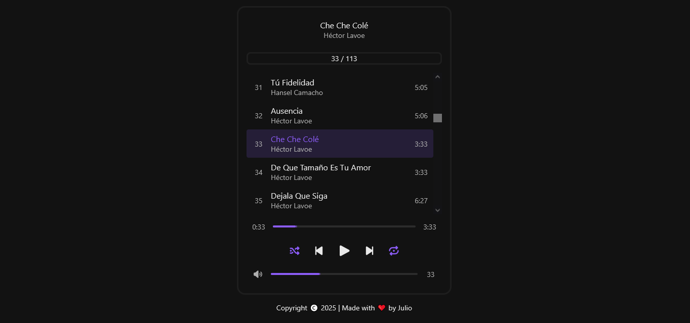

# Reproductor Web de Música
Un reproductor web desarrollado con Javascript, HTML y CSS que permite reproducir archivos de música.

## Características

- 🎵 Reproducción de archivos de música.
- 📃 Lista de reproducción integrada.
- 🔢 Numeración automática de pistas.
- 🔍 Visualización del título de la canción actual.
- 👤 Visualización del artista de la canción actual.
- ⏱️ Visualización de la duración individual de cada canción.
- 🎯 Resaltado visual de la canción seleccionada.
- 📜 Navegación mediante lista desplazable (scroll).
- 📊 Indicador de posición dentro de la playlist.
- ⏯️ Control de reproducción y pausa.
- ⏮️ Botón para retroceder a la canción anterior.
- ⏭️ Botón para avanzar a la siguiente canción.
- 🔀 Modo de reproducción aleatoria (Shuffle).
- 🔁 Modo de repetición (Repeat all, one, none).
- 📈 Barra de progreso de reproducción.
- ⌛ Indicador de tiempo transcurrido y duración total.
- 🔊 Control de volumen ajustable.
- 🎨 Interfaz moderna con tema oscuro.
- 🟣 Elementos visuales destacados mediante acentos púrpura.
- 📱 Diseño limpio e intuitivo enfocado en la experiencia de usuario.

## Vista previa

